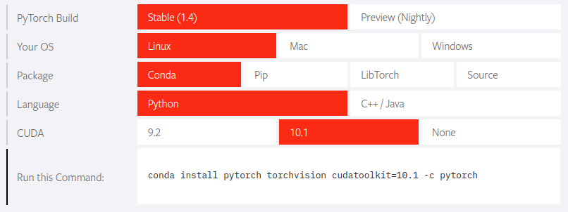
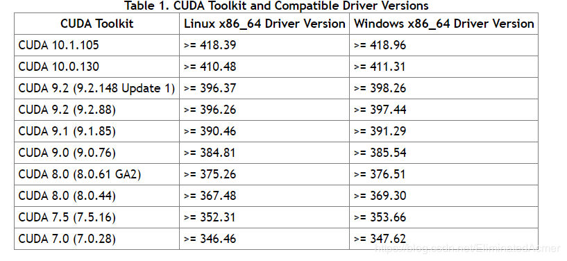
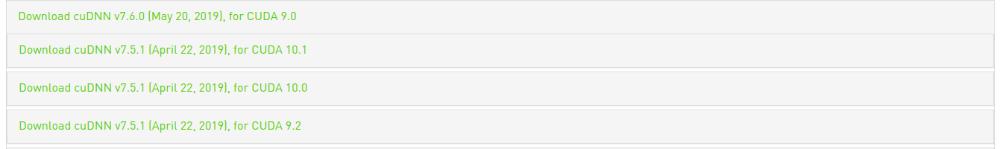
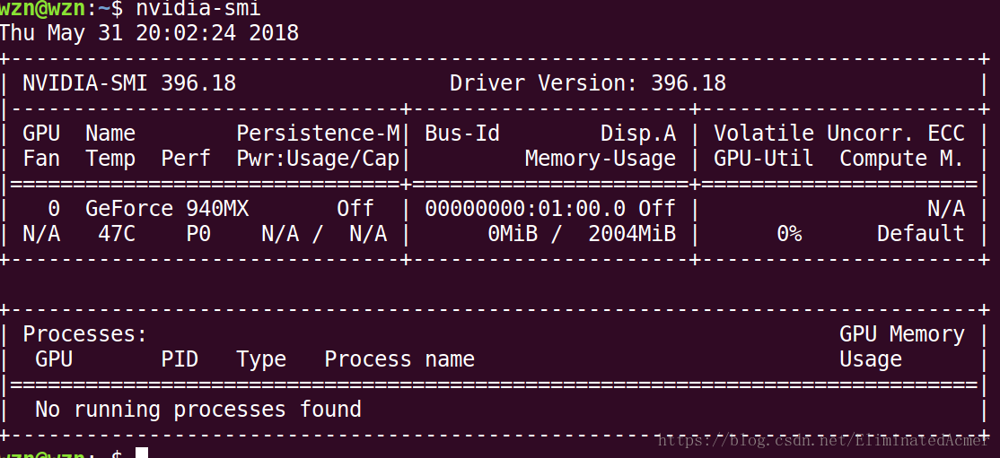
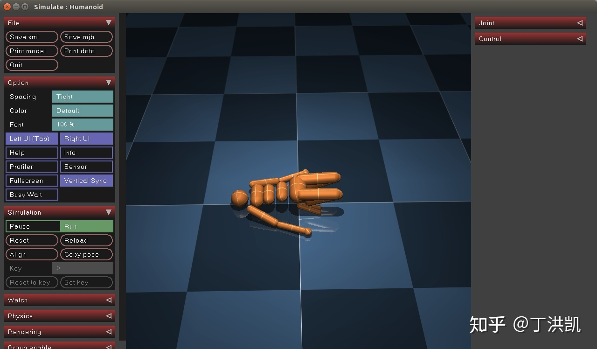

# Environment Config

To config a computer for deep learning or deep reinforcement learning, we install *cuda*, *cudnn*, *torch* and so on.
There may be some problems during install this software. I record my process of configuring the **DL environment**. My 
computer is a DELL PRECISION TOWER 7810 working station with Ubuntu 16.04 OS and Quadro VGA controller with M5000 GPU.

## Anaconda and Pycharm

### Conda

#### Installation
All you need to install ``conda`` is [here](https://docs.anaconda.com/anaconda/install/linux/).
[This tutorial](https://blog.csdn.net/qq_15192373/article/details/81091098) is in Chinese for your reference.

To increase the speed for ``conda install``, you should modify the download source for **conda**.

#### Source Channel
You could use 

`conda config --show` or `conda config --show channels` to check the *source channels*.

Use ``conda config --remove <channel name>`` to remove a channel.

To add *Tsinghua Souce channel* you need the following command:
```
conda config --add channels https://mirrors.tuna.tsinghua.edu.cn/anaconda/pkgs/free/
conda config --add channels https://mirrors.tuna.tsinghua.edu.cn/anaconda/pkgs/main/
conda config --set show_channel_urls yes
```
or you could edit the source channel in `.condarc`. This file is usually exists in `$HOME`. You could find it by using 
`sudo find / -name '.condarc'` 
After that, ``conda config --set show_channel_urls yes`` is need to show the download url for every installation.

[Here](https://blog.csdn.net/weixin_39278265/article/details/84782550) is a good tutorial for this work

#### Create Virtual Environment

- Show current environments: ``conda env list`` or ``conda info --envs``.
- Create new environments ``conda create -n <env_name> python=3.7``.
- Remove environments ``conda remove -n <env name> --all``
- Activate environments ``conda activate <env name>``
- Deactivate environments ``conda deactivate``

[A good blog](https://blog.csdn.net/u010821666/article/details/82351042)

### Pycharm-community

[Official Tutorial](https://www.jetbrains.com/help/pycharm/installation-guide.html#).

## Torch ,TF, CUDA and cudnn

The first thing you need to do is to make sure the match of the versions among all of these softwares.
The first step is to check the **CUDA** version corresponding with [**pytorch**](https://pytorch.org/).



The second step is to verify the **nvidia driver** version corresponding with **CUDA**.



Then, you need to make sure the the **cudnn** version corresponding with **CUDA**. This can be seen in 
[**cudnn**](https://developer.nvidia.com/rdp/cudnn-archive).



The version on my machine are as follows:

software      | version
--------------|--------
torch         | 1.4
CUDA          | 10.1
nvidia driver | 418
cudnn         | 7.5
tensorflow-gpu| 1.4

After these, you can start install them.

### Nvidia driver
You can use the following command to check the corresponding driver for your machine

``ubuntu-drivers devices`` 

Then, you can use command to install the nvidia driver.

```
sudo add-apt-repository ppa:graphics-drivers/ppa
sudo apt-get update
sudo apt install nvidia-418
```

You could watch the nvidia driver using:

``nvidia-smi`` or ``watch -n 10 nvidia-smi``

If the error is 
>Failed to initialize NVML: Driver/library version mismatch

This is because the kernel module of the nvidia is mismatch with current driver version. Under this condition.
restarting the machine is a good choice.

Then, you can see (the version is wrong because I can't get my working station now)



Some useful commands:

- see the info of VGA driver:
``lspci |grep VGA``
- see the info of nvidia VGA hard ware: 
``lspci |grep -i nvidia``

### CUDA

You can follow the tutorial in homepage of [**CUDA**](https://developer.nvidia.com/cuda-toolkit).
But you could only get the latest version of CUDA.
For history version, you need to visit [**history release**](https://developer.nvidia.com/cuda-toolkit-archive).
For version `10.1`, you can get it [**here**](https://developer.nvidia.com/cuda-10.1-download-archive-base).

Then, you can follow the command as follows:
```
sudo dpkg -i cuda-repo-ubuntu1604-10-1-local-10.1.105-418.39_1.0-1_amd64.deb
sudo apt-key add /var/cuda-repo-<version>/7fa2af80.pub
sudo apt-get update
sudo apt-get install cuda
```

In fact, it would be convient to install CUDA. However, I made a mistake during my procedure.
I tried to install `10.2` first and shut down before the last step. However, `dpkg` record the 
package in its memory. To install `10.1`, you need to run the following command first.
```
dpkg -r cuda-repo-<version>
dpkg -P cuda-repo-<version>
```
Some useful commands:
- see the version of CUDA:
``cat /usr/local/cuda/version.txt``

### cudnn

It is very easy to install cudnn. Here, I recommand you to install cudnn use `tar` rather than `deb`.

First, download it from [**cudnn**](https://developer.nvidia.com/rdp/cudnn-archive).
Then, run the following command:
```
sudo cp cuda/include/cudnn.h /usr/local/cuda/include/
sudo cp cuda/lib64/libcudnn* /usr/local/cuda/lib64/
sudo chmod a+r /usr/local/cuda/include/cudnn.h
sudo chmod a+r /usr/local/cuda/lib64/libcudnn*
```

Some useful commands:
- see the version of cudnn:
``cat /usr/local/cuda/include/cudnn.h | grep CUDNN_MAJOR -A 2``

### There are some method you could refer
- [using run file to install](https://blog.csdn.net/EliminatedAcmer/article/details/80528980)
- [some useful advice](https://blog.csdn.net/Marlon1993/article/details/101730005)
- [command line](https://blog.csdn.net/junzia/article/details/80871145)
- [do it in three ways](https://blog.csdn.net/wanzhen4330/article/details/81699769)
 
## DL Dependencies 
 
You need `tensorboardX`, `sciki-image`, `seaborn`, `matplotlib` and so on. Some of them may be have been installed 
during installation of **Torch** or **Tensorflow**, otherwise you need to `conda install` them manually.
 
## DRL Tools

### OpenAI baselines
Clone the source code and follow the [tutorial](https://github.com/openai/baselines).
Use `pip install -e .`, you could install the **baselines**.

### OpenAI gym
You should note that the **OpenAI gym** could also be installed. You don't need to install it again for the reason 
that there may be a version missmatch.

However you could still follow [gym](https://gym.openai.com/docs/) to install it.

### Mujoco and mujoco-py
It is also esay to install them if you are lucky.

#### Mujoco

You could get a 30 days trial license for [mujoco](https://www.roboti.us/license.html) for one machine.
An e-mail could get three machines. The trial is necessary because sometimes you can't install mujoco-py anyway.

Register your computer and get the license. For your computer id, download the *getid* file and then:
```
chmod +x getid
./getid
```

Download product first, for the mujoco version, you should see the [mujoco-py](https://github.com/openai/mujoco-py) for 
version support.

Then
```
$ mkdir ~/.mujoco 
$ cp mujoco200_linux.zip ~/.mujoco 
$ cd ~/.mujoco 
$ unzip mujoco200_linux.zip
$ cp -r mujoco200_linux mujoco200
```
the last line is because the mujoco_py will need the directory name without linux.

Copy license
```
$ cp mjkey.txt ~/.mujoco 
$ cp mjkey.txt ~/.mujoco/mujoco200/bin
```

Environment variable, edit `~/.bashrc` and add the following command in it. Then `source ~/.bashrc`.
```
export LD_LIBRARY_PATH=~/.mujoco/mujoco200/bin${LD_LIBRARY_PATH:+:${LD_LIBRARY_PATH}} 
export MUJOCO_KEY_PATH=~/.mujoco${MUJOCO_KEY_PATH}
```

Testing
```
$ cd ~/.mujoco/mujoco200_linux/bin 
$ ./simulate ../model/humanoid.xml
```
You will see.


For some remote machine, you will not the this for the limit of hardware, but for some you could see it.

#### mujoco-py

download source code `git clone https://github.com/openai/mujoco-py.git`. 

Install *patchelf*, this is for the `lG`.
```
$ sudo curl -o /usr/local/bin/patchelf https://s3-us-west-2.amazonaws.com/openai-sci-artifacts/manual-builds/patchelf_0.9_amd64.elf 
$ sudo chmod +x /usr/local/bin/patchelf
```

Install gcc dependencies:
```
sudo apt install libosmesa6-dev libgl1-mesa-glx libglfw3
```

Some other dependencies
```
$ cd ~/mujoco-py
$ cp requirements.txt requirements.dev.txt ./mujoco_py
$ cd mujoco_py
$ pip install -r requirements.txt
$ pip install -r requirements.dev.txt
```

Installation
```
$ cd ~/mujoco-py/vendor 
$ ./Xdummy-entrypoint 
$ cd .. 
$ python setup.py install
```

Testing, `import mujoco_py`, for the first time it will compile some file. If you face the *gcc error*, infer the 
trouble shooting in [mujoco-py](https://github.com/openai/mujoco-py). If this could not help you, may be you need 
change another computer.

 
- [A good tutorial](https://zhuanlan.zhihu.com/p/85833777)
- [Remote machine](https://zhuanlan.zhihu.com/p/77020893?from_voters_page=true)